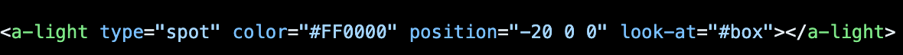

# Tool Learning Log

## Tool: Aframe

---

3/16/25:
* From the previous Monday I had explored what Mr. Mueller taught me to do in class. He said I should go to the A-frame website and press on docs. I should copy it into my IDE first to see how it works and then tinker with it. That is what I did, I changed the positions, the colors, and observed what numbers made up the shapes. Then I thought about how to associate it with Movie Production, and I found a solution. Since I spent a long time researching hardware, I can build a #D model of a camera. Not the super techy ones I researched about, but to start off, I'd build a resemblance of one.
* Since tinkering of this week I have explored more of the page and eventually saw that they had a Slack and Github account to research more of their tool on. <a href="https://github.com/aframevr/aframe/tree/master/docs/components" target="_blank">Visit A-Frame Components Docs</a> I also watched part of the video of where this guy used the inspector tool to put geometic shapes ontop of each other. <a href= https://www.youtube.com/watch?v=UYT97ZHPvEY>Youtube Inspection Tool</a>
* I think the biggest challange was to add the text ontop of the camera. iI just wanted to do it so people understand what it is because I know it's not the clearest 3D picture of one, but the more I tinker, the better I will get. I had trouble with getting it where I wanted to but I realized that I had to put "align" when I asked a friend. But I wasn't sure if it was going to work because "align" popped up as red which I thought was incorrect on my IDE but it turned out working fine. At first for planning I decided to split up a camera into different parts and comment it in my IDE so I wouldn't forget which parts I had to make out of those geometry shapes and I had to have a color wheel opened on tab to make surer I got the colors right. Maybe the only question I have is whether or not are these 3D models interactable and how do I approach that and add that to my FP. But thats really all I did for my thinking, I've learned so much and will improve my camera or make another hardware from my list next time.

### 3/23/25:
I learned about many differnt lights that I can incoporate in my freedom project to add style or just for the purposes of my hardware devices aswell.

 There are five differernt lights 

* Directional Light
<ul>

* shadows (high contrast)

* like sunlight
</ul>

* Point Light
<ul>

* one place light

* lightbulb effect
</ul>

*   Ambient Light
<ul>

* no shadows

* brightness everywhere
</ul>

* Spot Light
<ul>

* pointed triangle light (good for lights like stage)

* different sides of light and opacity
</ul>

* Hemisphere Light
<ul>

* shadows (low contrast)

* two different hues
</ul>

I watched this video for some inspiration on the differrent types of lighting and how to manage them: https://www.youtube.com/watch?v=7GEvyHcy-og.

A challange that I had is dechivering the differrence between spot and point lights, but the video explained they pretty well.

Basically, spot light is like a cone on the one object or scene and point is also light on that same thing but it bounces off everywhere else illuminating the presence of something.

Overall, I think that the spotlight will work better for my project so that is why I inserted the code here so I can use it later for little details in my Freedom Project.

### 4/13/25:
As a continuation from last year, I decided to take it upon myself to watch Part 2 of the video I watched last time about A-Frame—the beginning and the transformation of it.
https://www.youtube.com/watch?v=mETucqeOmXA&list=PLP3KjR1TMw7ekqC4o5gy0rR4odw7Jga84&index=2
In Part 2, she talks about how I can customize my three-dimensional objects using rotation, position, and textures. By doing this, I can use the XYZ coordinate system, which is simple for students—so it was really an advantage for me. For example, in the video, she shows how to rotate a box 45° on the Y-axis and view many different angles using her mouse and keyboard. Lastly, she gives the object a brick texture to create a realistic appearance.

In VR development, she shows us how to use tools like Inspector and how the minimal setup simplifies the work you do in A-Frame. She browses the Bootstrap website and talks about the different primitives it offers. Something really cool that I took away from the video is how she made one object into another—like making the circle ring a part of the sphere by making it its own section/primitive.

I have completed all the steps from my four-step journey of tinkering with my tool, and I'm ready to use it now.

<!--
* Links you used today (websites, videos, etc)
* Things you tried, progress you made, etc
* Challenges, a-ha moments, etc
* Questions you still have
* What you're going to try next
-->

